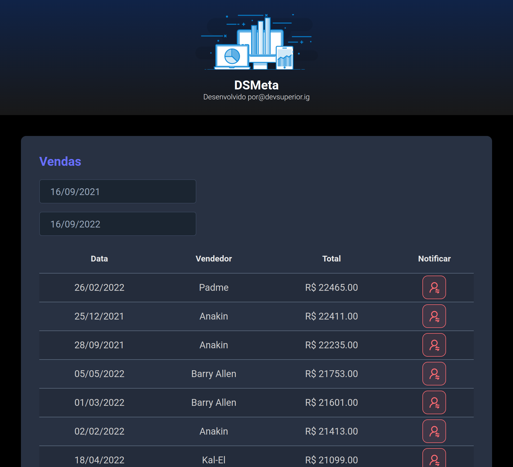

# DSMETA

Projeto criado no evento DevSuperior.

[Clique aqui para acessar](https://dsmeta-lucascaldas.netlify.app/)

## Tecnologias

- HTML
- CSS
- TYPESCRIPT
- REACT
- JAVA
- NODEJS
- BANCO DE DADOS H2
- HEROKU
- NETLIFY
- TWILIO 

## Objetivo

Site com um Dashboard de vendas por período contendo notificação via SMS por vendedor.

## Contato

lucas20caldas@gmail.com